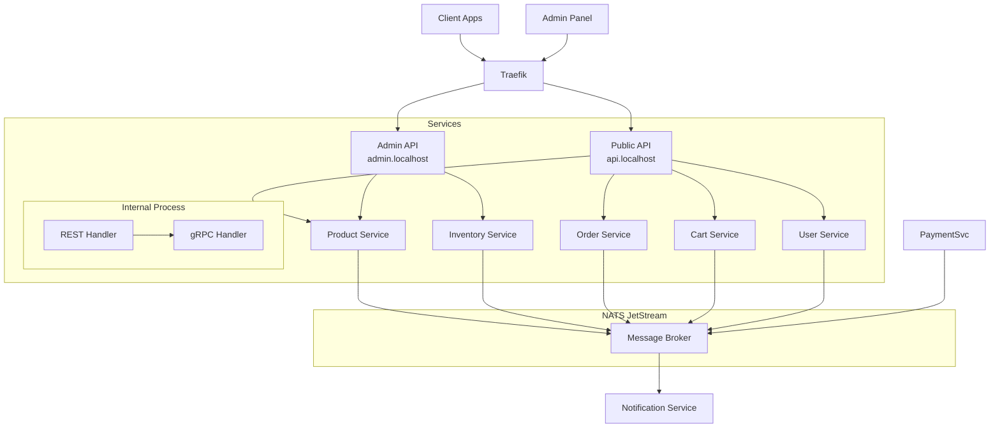

# Mallbots Microservices

Hệ thống E-commerce dựa trên Microservices Architecture với DDD (Domain-Driven Design), Clean Architecture và Event-Driven Design.

## Tech Stack

- **Backend**: Golang
- **Database**: PostgreSQL
- **Cache**: Redis
- **Message Broker**: NATS JetStream
- **RPC**: gRPC (với buf)
- **Container**: Docker & Docker Compose
- **Gateway**: Traefik

## System Architecture



## API Documentation

### Public APIs (api.localhost)

#### 1. User Service (Public)
```
REST APIs:
POST /api/v1/auth/signup
POST /api/v1/auth/login
GET /api/v1/users/me
PUT /api/v1/users/me

gRPC Internal APIs:
- ValidateToken(token) returns (UserInfo)
- GetUserById(id) returns (User)
```

#### 2. Product Service (Public)
```
REST APIs:
GET /api/v1/products
GET /api/v1/products/{id}
GET /api/v1/products/search
GET /api/v1/categories
GET /api/v1/categories/{id}
GET /api/v1/categories/{id}/products

gRPC Internal:
- GetProductPrice(productId) returns (Price)
- GetProductStock(productId) returns (Stock)
```

#### 3. Cart Service (Public)
```
REST APIs:
GET /api/v1/cart
POST /api/v1/cart/items
PUT /api/v1/cart/items/{id}
DELETE /api/v1/cart/items/{id}
POST /api/v1/cart/checkout

gRPC Internal APIs:
- ValidateCart(cartId) returns (CartValidation)
- GetCartById(cartId) returns (Cart)
```

#### 4. Order Service (Public)
```
REST APIs:
GET /api/v1/orders
GET /api/v1/orders/{id}
POST /api/v1/orders/{id}/cancel
GET /api/v1/orders/{id}/status

gRPC Internal APIs:
- UpdateOrderStatus(orderId, status)
- GetOrderById(orderId) returns (Order)
```

#### 5. Inventory Service (Internal)
```
gRPC APIs only:
- CheckStock(productId) returns (StockInfo)
- ReserveStock(productId, quantity) returns (Reservation)
- ReleaseStock(reservationId)
- UpdateStock(productId, quantity)
```

#### 6. Payment Service (Internal)
```
gRPC APIs only:
- ProcessPayment(orderId, amount) returns (PaymentResult)
- RefundPayment(paymentId) returns (RefundResult)
- GetPaymentStatus(paymentId) returns (PaymentStatus)
```


### Admin APIs (admin.localhost)

#### 1. Product Management
```
POST /api/v1/products
    Request:
    {
        "name": "Product Name",
        "description": "Description",
        "price": 99.99,
        "images": ["url1", "url2"],
        "categoryId": "cat-1"
    }

PUT /api/v1/products/{id}
DELETE /api/v1/products/{id}
GET /api/v1/products  # With admin filters
```

#### 2. Category Management
```
POST /api/v1/categories
PUT /api/v1/categories/{id}
DELETE /api/v1/categories/{id}
GET /api/v1/categories
```

#### 3. Inventory Management
```
PUT /api/v1/inventory/{productId}/stock
    Request:
    {
        "quantity": 100,
        "type": "SET|ADD|SUBTRACT"
    }

POST /api/v1/inventory/batch-update
    Request:
    {
        "items": [
            {
                "productId": "prod-1",
                "quantity": 100
            }
        ]
    }
```

#### 4. Order Management
```
GET /api/v1/orders
PUT /api/v1/orders/{id}/status
    Request:
    {
        "status": "CONFIRMED|SHIPPED|DELIVERED"
    }
```

#### 5. Dashboard APIs
```
GET /api/v1/dashboard/stats
    Response:
    {
        "totalOrders": 1000,
        "totalRevenue": 99999.99,
        "totalUsers": 500,
        "pendingOrders": 50
    }

GET /api/v1/dashboard/sales
GET /api/v1/dashboard/top-products
GET /api/v1/dashboard/inventory-alerts
```

## Project Structure

```
.
├── services/
│   ├── product/
│   │   ├── cmd/
│   │   │   └── main.go        # Single entry point cho cả REST & gRPC
│   │   ├── internal/
│   │   │   ├── server/
│   │   │   │   ├── grpc.go    # gRPC implementation
│   │   │   │   └── rest.go    # REST handlers
│   │   │   ├── domain/        # Domain objects & logic
│   │   │   └── service/       # Business logic
│   │   └── proto/
│   │       └── product.proto  # API definitions
│   ├── inventory/
│   ├── order/
│   ├── user/
│   ├── cart/
│   └── payment/
├── pkg/                      # Shared packages
│   ├── auth/
│   ├── database/
│   ├── logger/
│   └── messaging/
└── deploy/
    ├── docker/
    └── k8s/
```

### schema
```prisma
// User Service
model User {
  id        Int      @id @default(autoincrement()) @map("id")
  userId    String   @unique @map("user_id")
  email     String   @unique @map("email")
  password  String   @map("password")
  fullName  String   @map("full_name")
  role      String   @default("USER") @map("role")

  createdAt DateTime @default(now()) @map("created_at")
  updatedAt DateTime @updatedAt @map("updated_at")

  @@index([email])
  @@map("users")
}

// Product Service
model Product {
  id          Int      @id @default(autoincrement()) @map("id")
  productId   String   @unique @map("product_id")
  name        String   @map("name")
  description String?  @map("description")
  price       Float    @map("price")
  images      String[] @map("images")
  categoryId  Int      @map("category_id")
  category    Category @relation(fields: [categoryId], references: [id])

  createdAt   DateTime @default(now()) @map("created_at")
  updatedAt   DateTime @updatedAt @map("updated_at")

  @@index([categoryId])
  @@map("products")
}

model Category {
  id        Int       @id @default(autoincrement()) @map("id")
  categoryId String   @unique @map("category_id")
  name      String   @map("name")
  products  Product[]

  createdAt DateTime @default(now()) @map("created_at")
  updatedAt DateTime @updatedAt @map("updated_at")

  @@map("categories")
}

// Cart Service
model Cart {
  id        Int        @id @default(autoincrement()) @map("id")
  cartId    String     @unique @map("cart_id")
  userId    String     @map("user_id")
  status    String     @default("ACTIVE") @map("status")
  items     CartItem[]

  createdAt DateTime   @default(now()) @map("created_at")
  updatedAt DateTime   @updatedAt @map("updated_at")

  @@index([userId, status])
  @@map("carts")
}

model CartItem {
  id        Int      @id @default(autoincrement()) @map("id")
  itemId    String   @unique @map("item_id")
  cartId    Int      @map("cart_id")
  cart      Cart     @relation(fields: [cartId], references: [id])
  productId String   @map("product_id")
  quantity  Int      @map("quantity")
  price     Float    @map("price")

  createdAt DateTime @default(now()) @map("created_at")
  updatedAt DateTime @updatedAt @map("updated_at")

  @@index([cartId])
  @@map("cart_items")
}

// Order Service
model Order {
  id              Int         @id @default(autoincrement()) @map("id")
  orderId         String      @unique @map("order_id")
  userId          String      @map("user_id")
  status          String      @default("PENDING") @map("status")
  totalAmount     Float       @map("total_amount")
  paymentStatus   String      @default("PENDING") @map("payment_status")
  shippingAddress String?     @map("shipping_address")
  items           OrderItem[]

  createdAt       DateTime    @default(now()) @map("created_at")
  updatedAt       DateTime    @updatedAt @map("updated_at")

  @@index([userId, status, createdAt(sort: Desc)])
  @@map("orders")
}

model OrderItem {
  id        Int      @id @default(autoincrement()) @map("id")
  itemId    String   @unique @map("item_id")
  orderId   Int      @map("order_id")
  order     Order    @relation(fields: [orderId], references: [id])
  productId String   @map("product_id")
  quantity  Int      @map("quantity")
  price     Float    @map("price")

  createdAt DateTime @default(now()) @map("created_at")
  updatedAt DateTime @updatedAt @map("updated_at")

  @@index([orderId])
  @@map("order_items")
}

// Inventory Service
model Inventory {
  id         Int      @id @default(autoincrement()) @map("id")
  inventoryId String  @unique @map("inventory_id")
  productId  String   @unique @map("product_id")
  stock      Int      @default(0) @map("stock")

  createdAt  DateTime @default(now()) @map("created_at")
  updatedAt  DateTime @updatedAt @map("updated_at")

  @@index([productId])
  @@map("inventory")
}

model StockReservation {
  id            Int      @id @default(autoincrement()) @map("id")
  reservationId String   @unique @map("reservation_id")
  productId     String   @map("product_id")
  quantity      Int      @map("quantity")
  status        String   @default("PENDING") @map("status")
  expireAt      DateTime @map("expire_at")

  createdAt     DateTime @default(now()) @map("created_at")
  updatedAt     DateTime @updatedAt @map("updated_at")

  @@index([productId, status])
  @@map("stock_reservations")
}

// Payment Service
model Payment {
  id          Int      @id @default(autoincrement()) @map("id")
  paymentId   String   @unique @map("payment_id")
  orderId     String   @unique @map("order_id")
  amount      Float    @map("amount")
  status      String   @default("PENDING") @map("status")

  createdAt   DateTime @default(now()) @map("created_at")
  updatedAt   DateTime @updatedAt @map("updated_at")

  @@index([orderId, status])
  @@map("payments")
}
```

## Development Setup

### Prerequisites
- Go 1.22+
- Docker & Docker Compose
- Protocol Buffers compiler
- buf CLI
- Make

### Docker Compose Configuration

```yaml
version: '3.8'

services:
  traefik:
    image: traefik:v2.10
    command:
      - "--api.insecure=true"
      - "--providers.docker=true"
      - "--providers.docker.exposedbydefault=false"
      - "--entrypoints.web.address=:80"
      - "--entrypoints.grpc.address=:50051"
    ports:
      - "80:80"
      - "8080:8080"  # Dashboard
    volumes:
      - /var/run/docker.sock:/var/run/docker.sock:ro
      - ./traefik.yml:/etc/traefik/traefik.yml:ro

  user-service:
    build: ./services/user
    ports:
      - "8081:8080"  # REST
      - "9001:9001"  # gRPC
    labels:
      - "traefik.enable=true"
      - "traefik.http.routers.user.rule=Host(`api.localhost`) && PathPrefix(`/api/v1/auth`, `/api/v1/users`)"
      - "traefik.http.services.user.loadbalancer.server.port=8080"
    depends_on:
      - postgres
      - redis
      - nats

  product-service:
    build: ./services/product
    ports:
      - "8082:8080"  # REST
      - "9002:9001"  # gRPC
    labels:
      - "traefik.enable=true"
      - "traefik.http.routers.product.rule=Host(`api.localhost`) && PathPrefix(`/api/v1/products`)"
      - "traefik.http.services.product.loadbalancer.server.port=8080"

  postgres:
    image: postgres:15-alpine
    environment:
      POSTGRES_USER: mallbots
      POSTGRES_PASSWORD: mallbots
      POSTGRES_DB: mallbots
    ports:
      - "5432:5432"
    volumes:
      - postgres_data:/var/lib/postgresql/data

  redis:
    image: redis:alpine
    ports:
      - "6379:6379"

  nats:
    image: nats:latest
    command:
      - "--js"
    ports:
      - "4222:4222"
      - "8222:8222"

volumes:
  postgres_data:
```

### Traefik Configuration

```yaml
# traefik.yml
api:
  dashboard: true

log:
  level: INFO

entryPoints:
  web:
    address: ":80"
  grpc:
    address: ":50051"

providers:
  docker:
    endpoint: "unix:///var/run/docker.sock"
    exposedByDefault: false

http:
  routers:
    public-api:
      rule: "Host(`api.localhost`)"
      service: public-api
      middlewares:
        - jwt-auth

    admin-api:
      rule: "Host(`admin.localhost`)"
      service: admin-api
      middlewares:
        - admin-auth

  middlewares:
    jwt-auth:
      jwt:
        secret: "${JWT_SECRET}"

    admin-auth:
      jwt:
        secret: "${JWT_SECRET}"
      forwardAuth:
        address: "http://user-service:8080/api/v1/auth/verify-admin"
```

## Security

### Admin Authentication
- JWT với role-based access control
- Middleware verify admin role
- Rate limiting cho admin APIs

### Installation & Setup
```bash
# Clone repository
git clone [repository-url]

# Install tools
make install-tools

# Start all services
docker-compose up -d

# Check logs
docker-compose logs -f

# Stop services
docker-compose down
```

### Local Development Testing
```bash
# Test REST APIs
curl -X POST http://api.localhost/api/v1/auth/login \
  -H "Content-Type: application/json" \
  -d '{"email": "test@example.com", "password": "test123"}'

# Test gRPC (using grpcurl)
grpcurl -plaintext \
  -d '{"email": "test@example.com", "password": "test123"}' \
  localhost:9001 user.UserService/Login
```

## Monitoring & Security

### Authentication
JWT authentication thông qua Traefik middleware:
```yaml
jwt-auth:
  jwt:
    secret: "${JWT_SECRET}"
```

### Rate Limiting
```yaml
rate-limit:
  rateLimit:
    average: 100
    burst: 50
```

### Monitoring
- Prometheus metrics
- Grafana dashboards
- Jaeger tracing
- ELK stack for logging

## Contributing

1. Fork repository
2. Create feature branch (`git checkout -b feature/amazing-feature`)
3. Commit changes (`git commit -m 'Add some amazing feature'`)
4. Push to branch (`git push origin feature/amazing-feature`)
5. Create Pull Request

## License

MIT License
