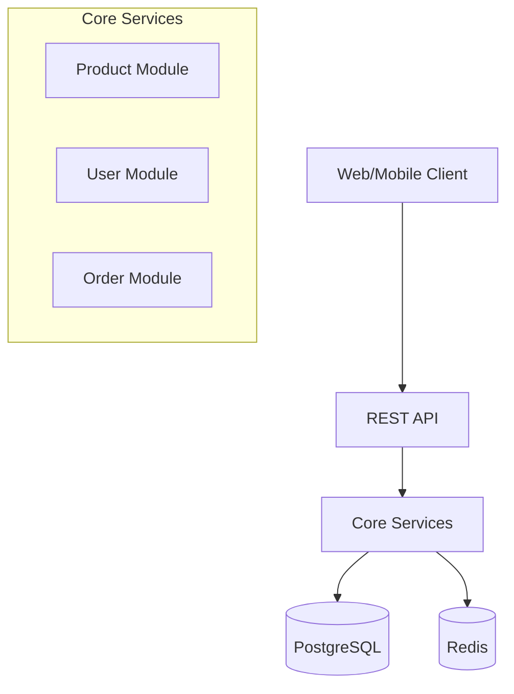

# E-commerce Pet Project

Hệ thống E-commerce đơn giản, có thể mở rộng thành microservices sau này.

## Phase 1: Monolith Setup (2-3 tuần đầu)

### Tech Stack
- **Backend**: Golang
- **Database**: PostgreSQL
- **Cache**: Redis (optional)
- **API Style**: RESTful

### System Architecture (Initial)


### Core Features
1. User Module:
   - Đăng ký, đăng nhập
   - Quản lý profile

2. Product Module:
   - Danh sách sản phẩm
   - Chi tiết sản phẩm
   - Tìm kiếm đơn giản

3. Order Module:
   - Giỏ hàng
   - Đặt hàng
   - Xem lịch sử đơn hàng

### Project Structure
```
.
├── cmd/
│   └── server/
│       └── main.go                # Entry point
├── modules/
│   ├── user/
│   │   ├── application/
│   │   │   ├── dto/
│   │   │   │   └── user_dto.go
│   │   │   └── services/
│   │   │       └── user_service.go
│   │   ├── domain/
│   │   │   ├── entities/
│   │   │   │   └── user.go
│   │   │   └── interfaces/
│   │   │       ├── user_repository.go
│   │   │       └── user_service.go
│   │   └── infrastructure/
│   │       ├── di/
│   │       │   └── wire.go
│   │       ├── query/
│   │       │   ├── gen/
│   │       │   └── user.sql
│   │       ├── repositories/
│   │       │   └── user_repository.go
│   │       └── rest/
│   │           └── user_handler.go
│   ├── product/
│   │   └── ...
│   └── order/
│       └── ...
├── shared/                   # Shared packages giữa các services
│   ├── common/              # Common utilities & helpers
├── plugins/                  # Component packages
│   ├── database/
│   │   └── postgres/
├── go.mod
├── go.sum
├── docker-compose.yml
├── sqlc.yaml
├── Makefile
└── prismas/ # migrations
```

### Database Schema
```sql
-- Users
CREATE TABLE users (
    id SERIAL PRIMARY KEY,
    email VARCHAR(255) UNIQUE NOT NULL,
    password VARCHAR(255) NOT NULL,
    full_name VARCHAR(255),
    created_at TIMESTAMP DEFAULT CURRENT_TIMESTAMP
);

-- Products
CREATE TABLE products (
    id SERIAL PRIMARY KEY,
    name VARCHAR(255) NOT NULL,
    description TEXT,
    price DECIMAL(10,2) NOT NULL,
    stock INT NOT NULL DEFAULT 0,
    created_at TIMESTAMP DEFAULT CURRENT_TIMESTAMP
);

-- Orders
CREATE TABLE orders (
    id SERIAL PRIMARY KEY,
    user_id INT REFERENCES users(id),
    total_amount DECIMAL(10,2) NOT NULL,
    status VARCHAR(50) DEFAULT 'pending',
    created_at TIMESTAMP DEFAULT CURRENT_TIMESTAMP
);

CREATE TABLE order_items (
    id SERIAL PRIMARY KEY,
    order_id INT REFERENCES orders(id),
    product_id INT REFERENCES products(id),
    quantity INT NOT NULL,
    price DECIMAL(10,2) NOT NULL
);
```

### API Endpoints

```
# User APIs
POST /api/v1/auth/register
POST /api/v1/auth/login
GET  /api/v1/users/me

# Product APIs
GET  /api/v1/products
GET  /api/v1/products/{id}
GET  /api/v1/products/search

# Order APIs
GET  /api/v1/cart
POST /api/v1/cart/items
POST /api/v1/orders
GET  /api/v1/orders
GET  /api/v1/orders/{id}
```

### Development Setup

1. Prerequisites:
```bash
# Cần cài đặt
- Go 1.22+
- Docker & Docker Compose
- Make (optional)
```

2. Quick Start:
```bash
# Clone project
git clone [your-repo]

# Start database
docker-compose up -d

# Run server
go run cmd/server/main.go
```

3. Docker Compose Basic:
```yaml
version: '3.8'
services:
  postgres:
    image: postgres:15-alpine
    environment:
      POSTGRES_USER: ecommerce
      POSTGRES_PASSWORD: ecommerce
      POSTGRES_DB: ecommerce
    ports:
      - "5432:5432"
    volumes:
      - pgdata:/var/lib/postgresql/data

  redis:
    image: redis:alpine
    ports:
      - "6379:6379"

volumes:
  pgdata:
```

## Phase 2: Kế hoạch mở rộng (Sau 1-2 tháng)

1. Tách services:
- Tách thành 3 service riêng biệt
- Thêm message queue (NATS)
- Thêm API Gateway

2. Thêm tính năng:
- Quản lý inventory
- Thanh toán
- Thông báo
- Admin dashboard

3. Cải thiện infrastructure:
- Container orchestration
- Monitoring
- CI/CD

## Contributing
1. Fork project
2. Tạo feature branch
3. Commit changes
4. Push và tạo Pull Request

## License
MIT License
